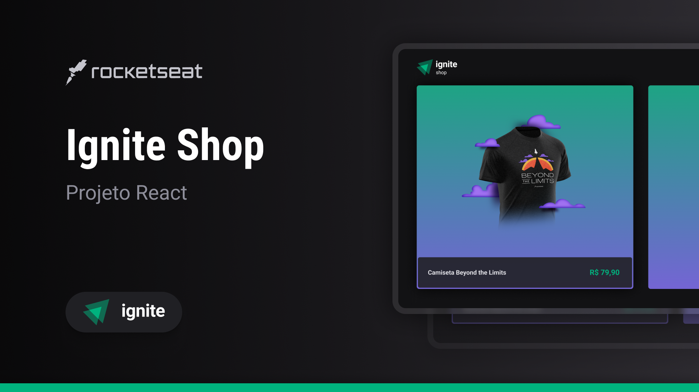

<!-- markdownlint-disable MD033 -->
<!-- markdownlint-disable MD041 -->

<div align="center">
   <a href="https://github.com/mgckaled">
      
   </a>
   
   
   <a href="https://github.com/mgckaled/ignite-react_ignite-shop/commits/main">
      
   </a>
   
  
</div>

<br>

# `React - Ignite Shop`

<div align="center">

[**Sobre o Projeto**](#sobre-o-projeto) &nbsp;&nbsp;&#124;&nbsp;&nbsp;
[**Deploy**](#deploy) &nbsp;&nbsp;&#124;&nbsp;&nbsp;
[**Tecnologias**](#tecnologias) &nbsp;&nbsp;&#124;&nbsp;&nbsp;
[**Layout**](#layout) &nbsp;&nbsp;&#124;&nbsp;&nbsp;
[**Configurações**](#configurações) &nbsp;&nbsp;&#124;&nbsp;&nbsp;
[**Licença**](#licença)

</div>

<br>

<p align="center">
  
</p>

## Sobre o Projeto

Nesse projeto foi desenvolvido o Ignite Fleet, um aplicativo de gestão de veículos Offline first que permite registrar a utilização de veículos e visualizar no mapa, obtendo a localização.

## Deploy

Indisponível.

## Tecnologias

- [`React`](https://reactnative.dev/)
- [`TypeScript`](https://www.typescriptlang.org/)
- [`NextJs`](https://nextjs.org/)
- [`ESLint`](https://eslint.org/)
- [`Prettier`](https://prettier.io/)
- [`Stitches`](https://stitches.dev/)
- [`Stripe`](https://stripe.com/br)
- [`Axios`](https://axios-http.com/ptbr/)
- [`Keen Slider`](https://keen-slider.io/)

## Layout

Acesse o layout do projeto [`AQUI`](https://www.figma.com/file/JDSQtflUu587m4rjBd7Un1).

É necessário ter conta no [Figma](https://figma.com) para acessar os layouts.

## Configurações

Necessário realizar as seguintes instalações:

- [Git](https://git-scm.com/)
- [npm](https://www.npmjs.com/)
- [Node](https://nodejs.org/)

Criar conta e configurar os serviços externos:

- [GitHub](https://github.com/)

Clonar repositório:

```bash
# Execute o comando git clone para realizar o clone do repositório
$ git clone https://github.com/mgkclaed/ignite-react_ignite-shop.git
# Entre na pasta do repositório clonado
$ cd ignite-react_ignite-shop
```

Dependências e inicialização:

```bash
## instalar dependências
$ npm i
```

## Licença

Distribuído sob a licença **_MIT_**. Veja [LICENSE](LICENSE) para mais informações.

## Autor

Feito com ❤️ por [`Marcel Kaled`](https://github.com/mgckaled/).
